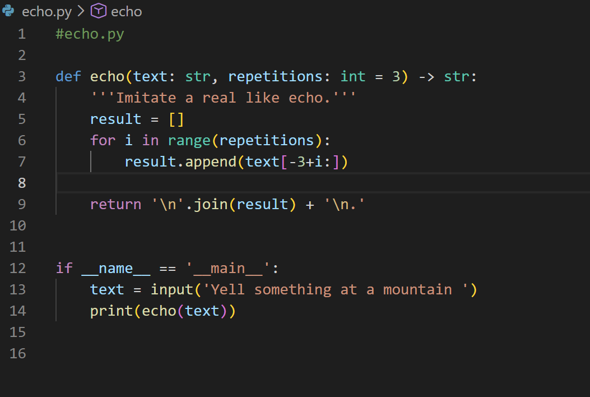

# Assignment_1_Python_Refresher
Dillon Callaghan's CS3980 Assignment 1 Python Refresher

## Echo file

**Here is the picture of my echo.py code:**

**Here is the text output of a test run of my program:**

c:/Users/dcall/OneDrive/Documents/GitHub/Assignment_1_Python_Refresher/echo.py
Yell something at a mountain: abcdefg 
efg 
fg 
g 
.