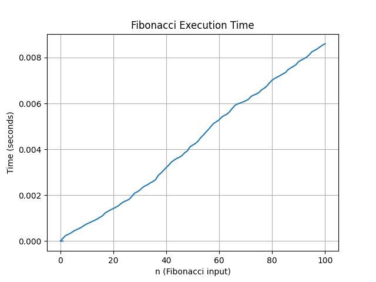

# Assignment_1_Python_Refresher
Dillon Callaghan's CS3980 Assignment 1 Python Refresher

## Echo file

**Here is the picture of my echo.py code:**

**Here is the text output of a test run of my program:**

c:/Users/dcall/OneDrive/Documents/GitHub/Assignment_1_Python_Refresher/echo.py
Yell something at a mountain: abcdefg 
efg 
fg 
g 
.

## Fib File

**Here is a picture of the graph I created to show the Fibonacci number calculation by time in seconds**

The plot shows the execution time for calculating each Fibonacci number, where the x-axis represents the value of n and the y-axis represents the time in seconds. Even though lru_cache greatly improves performance, the execution time still gradually increases as n grows due to additional function calls and overhead. This results in a smooth upward curve rather than an exponential increase.